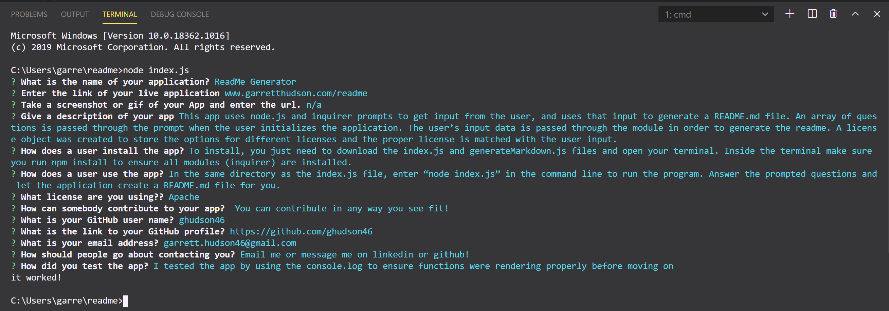
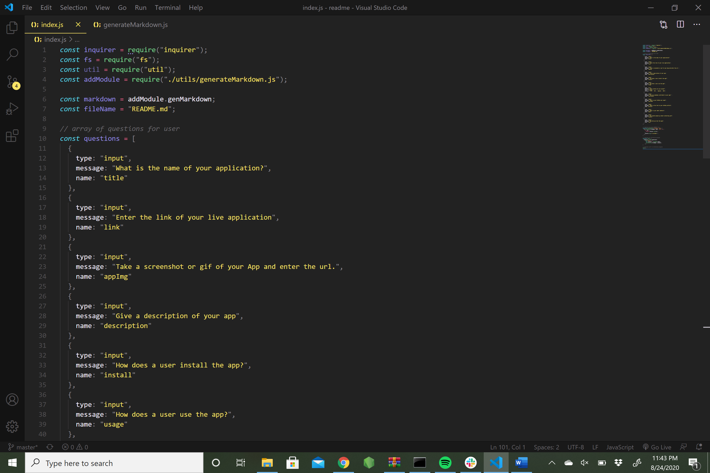
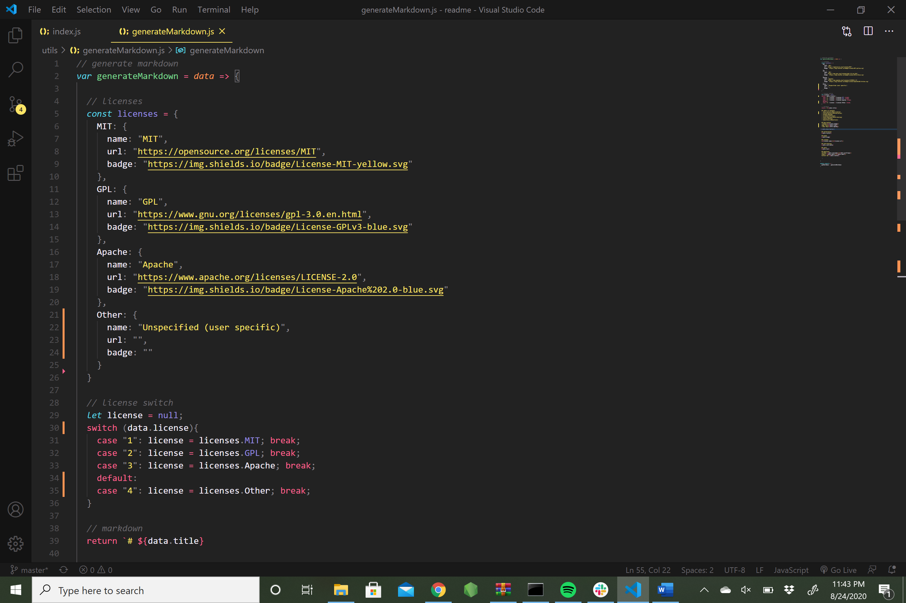
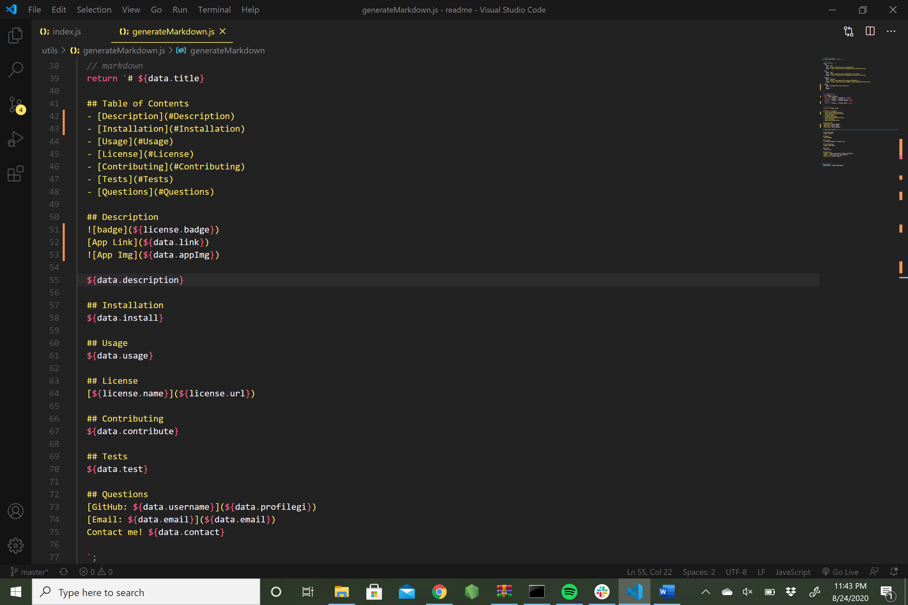

# README Generator
  ## Table of Contents
  - [Description](#Description)
  - [Installation](#Installation)
  - [Usage](#Usage)
  - [License](#License)
  - [Contributing](#Contributing)
  - [Tests](#Tests)
  - [Questions](#Questions)
  ## Description
  
  [App Link](https://github.com/ghudson46/readme)
  
  This app uses node.js and inquirer prompts to get input from the user, and uses that input to generate a README.md file. An array of questions is passed through the prompt when the user initializes the application. The user’s input data is passed through the module in order to generate the readme. A license object was created to store the options for different licenses and the proper license is matched with the user input.    
  ## Installation
  To install, you just need to download the index.js and generateMarkdown.js files and open your terminal. Inside the terminal make sure you run npm install to ensure all modules (inquirer) are installed.
  ## Usage
  In the same directory as the index.js file, enter “node index.js” in the command line to run the program. Answer the prompted questions and let the application create a README.md file for you. 
  ## License
  [MIT](https://opensource.org/licenses/MIT)
  ## Contributing
  Others can contribute by creating their own branch and pushing to it. I am glad to work with anybody
  ## Tests
  The app was tested by using console.log to check if functions were rendering correctly before moving on.
  ## Questions
  [GitHub: ghudson46](https://github.com/ghudson46)
  [Email: garrett.hudson46@gmail.com](garrett.hudson46@gmail.com)
  Contact me! Reach out to me via email or direct message on social media!
  